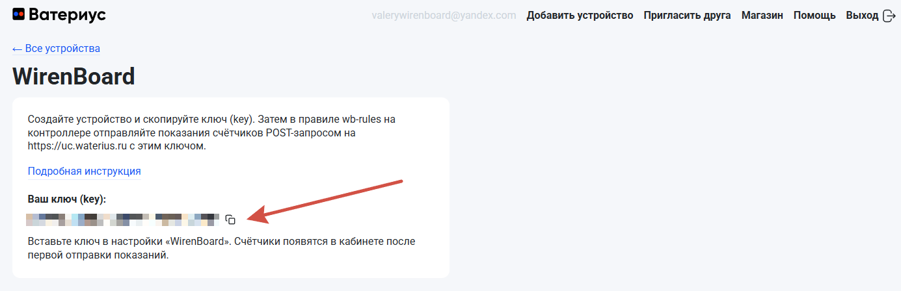
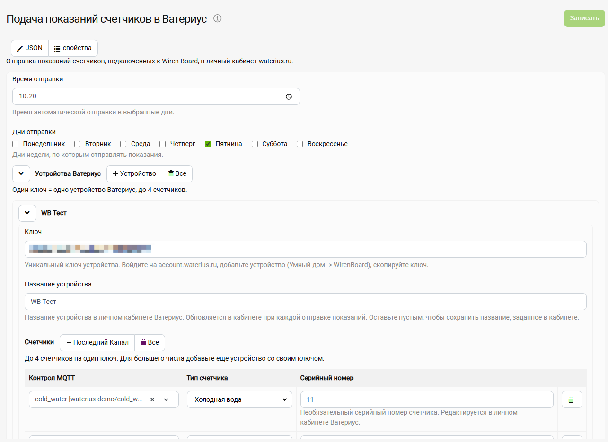
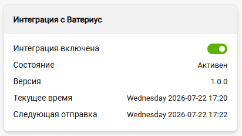
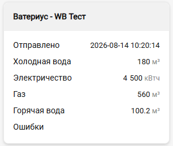

# wb-mqtt-waterius

Сервис-мост, отправляющий показания счётчиков, подключённых к Wiren Board, в личный кабинет [Ватериус](https://waterius.ru) через универсальный HTTP API. Сам прибор Waterius при этом не нужен, источником служит любой топик контроллера: импульсный вход, Modbus-счётчик, виртуальный контрол из wb-rules.

[Как настроить — статья на вики](https://wiki.wirenboard.com/wiki/Waterius)

## Возможности

- Отправка по расписанию — время `ЧЧ:ММ` и дни недели
- Одно устройство в кабинете Ватериуса — это один ключ, один лицевой счёт и до 4 счётчиков
- Источник каждого счётчика — любой MQTT-топик контроллера с показанием нарастающим итогом, значение уходит без пересчёта
- Показания и статус отправки видны в веб-интерфейсе как обычные WB-устройства
- Переключатель автоотправки на карточке, разовая отправка и dry-run из командной строки

## Как выглядит

### Устройство в кабинете Ватериуса

Ключ берётся на странице устройства в [личном кабинете](https://account.waterius.ru). Счётчики в кабинете появляются сами после первой отправки.



### Конфигуратор на контроллере

Форма живёт в «Настройки → Конфигурационные файлы → Подача показаний счетчиков в Ватериус». В ней время и дни отправки, список устройств с ключами и каналы с типами счётчиков.



### Виртуальные устройства

Сервис публикует устройство интеграции со статусом и по устройству на каждый ключ. У устройства ключа — каналы-зеркала показаний, штамп «Отправлено» и текст последней ошибки, а подписано оно как «Ватериус - <название из конфигуратора>».

 

## Как это работает

Источники — обычные контролы контроллера, свои устройства сервис публикует по [WB MQTT Conventions](https://github.com/wirenboard/conventions).

1. **Подписывается** на топики-источники из конфига и зеркалит значения в свои каналы, поэтому в интерфейсе видно ровно то, что уйдёт в облако
2. **В назначенную минуту** собирает по каждому устройству с ключом данные и отправляет `POST` на `https://uc.waterius.ru`
3. **Различает ошибки** — временные дожимает до конца дня, а неверный ключ держит красным до следующего планового запуска
4. **Переживает перезапуск** — положение переключателя, отметка отправки за день и штампы лежат в `/var/lib/wb-mqtt-waterius/state.json`

## Командная строка

```sh
wb-mqtt-waterius daemon           # запуск сервиса (systemd делает это сам)
wb-mqtt-waterius send             # разовая отправка сейчас и выход
wb-mqtt-waterius send --dry-run   # собрать и вывести payload без отправки
wb-mqtt-waterius --version        # версия установленного пакета
```

## Документация для разработчиков

- [docs/arc42.md](docs/arc42.md) — архитектура (arc42)
