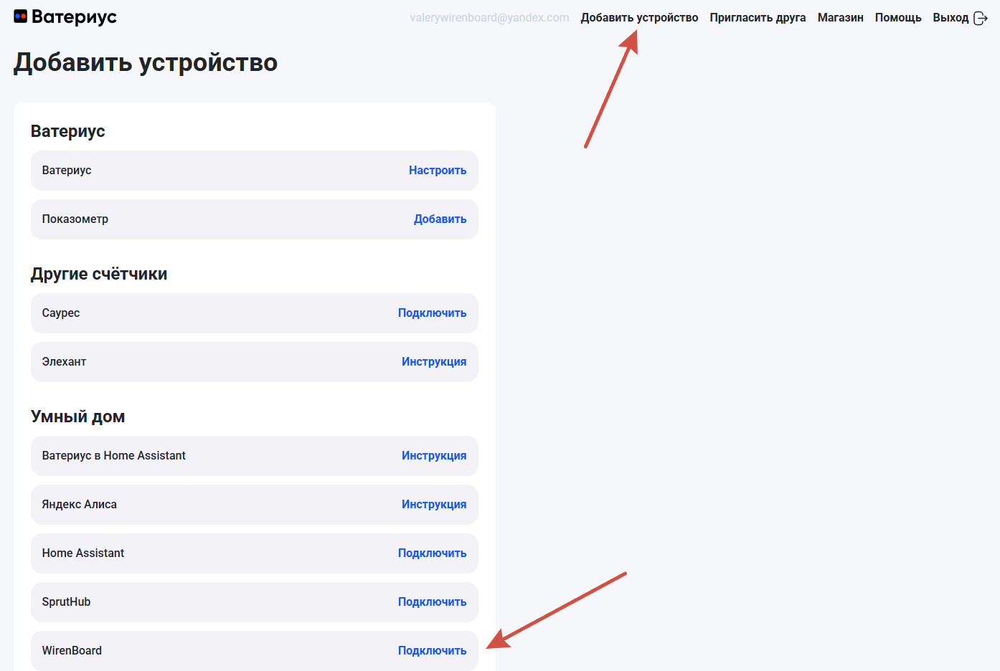

# wb-mqtt-waterius

Отправка показаний счётчиков, подключённых к Wiren Board, в личный кабинет
[waterius.ru](https://waterius.ru) через универсальный HTTP API.

Сервис в выбранные дни и время читает значения из MQTT-топиков контроллера и отправляет
их в облако Waterius. Один ключ = одно устройство Waterius = до 4 счётчиков.

## Шаг 1. Создать устройство в кабинете Waterius

Войдите на [account.waterius.ru](https://account.waterius.ru) и нажмите **«Добавить
устройство»** в верхнем меню. В разделе **«Умный дом»** выберите **WirenBoard** и нажмите
**«Подключить»**.



Откроется страница устройства с ключом. Скопируйте **ключ (key)** — он понадобится
в конфигураторе.


## Шаг 2. Настроить сервис в веб-интерфейсе Wiren Board

Откройте **Настройки → Конфигурационные файлы → «Подача показаний счетчиков в Ватериус»**.


Заполните форму.

1. **Время отправки** и **Дни отправки** — когда сервис отправляет показания.
2. **Устройства Ватериус → «+ Устройство»** — вставьте скопированный ключ в поле **«Ключ»**.
3. **Счётчики** — для каждого счётчика выберите **контрол MQTT** (топик, откуда берется
   значение), **тип счётчика** и, при желании, **серийный номер**. До 4 счётчиков на один
   ключ. Для большего числа добавьте ещё одно устройство с отдельным ключом.
4. Нажмите **«Записать»**.

## Шаг 3. Проверить результат

После сохранения в разделе **«Устройства»** появляется пульт **«Интеграция с Ватериус»**
(статус, переключатель автоотправки, версия, время следующей отправки) и по устройству на
каждый ключ с каналами-зеркалами показаний и полями «Отправлено» / «Ошибки». Данные
счетчиков появятся в кабинете автоматически после первой отправки показаний.

 

## CLI

```sh
wb-mqtt-waterius daemon           # запуск сервиса (systemd делает это сам)
wb-mqtt-waterius send             # разовая отправка сейчас и выход
wb-mqtt-waterius send --dry-run   # собрать и вывести payload без отправки
wb-mqtt-waterius --version
```
